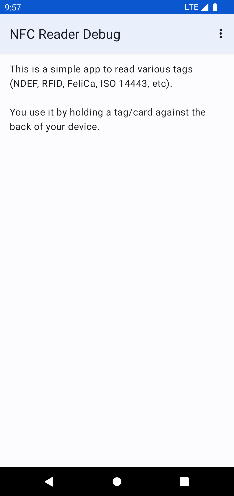

# NFC Reader

This is a simple app to read various tags (NDEF, RFID, FeliCa, ISO 14443, etc).

It has been forked from https://github.com/nadam/nfc-reader.
Differences between the original app and this fork:
* Use gradle build system
* Remove jar and apk file from repo
* Update dependencies and targetSdk

## Maintenance notice

From my point of view this app is feature complete. I probably won't add new major features on my own, but I will:
* Keep dependencies up-to-date
* Merge new translations
* Fix bugs
* Review and merge PRs, even for new features

## Translations

App strings and the app store description can be translated via Crowdin: https://crowdin.com/project/nfc-reader

## Credits

* Feature graphic by https://unsplash.com/de/@vishnumaiea
